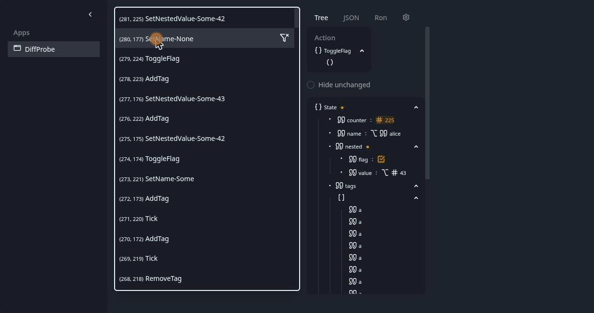

# bwu_redux_devtools

A Redux DevTools GUI and gRPC server for [bwu_redux](https://github.com/BeWellUp/bwu_redux)
stores, built with [Dioxus](https://dioxuslabs.com/) for desktop and web (WASM).

Connected apps stream every dispatched action and the resulting state to the
DevTools server; the GUI shows the action history per app and lets you inspect
any recorded state as a collapsible tree, JSON, or RON.

The Tree view color-codes what changed since the previous action (added,
removed, changed), with a toggle to hide everything that didn't change:



## Installation

The crate is not yet on crates.io (it depends on the official Dioxus
components, whose `dioxus-primitives` crate is currently a git dependency).
Until then, install from GitHub:

```bash
# Desktop GUI (embeds the DevTools gRPC server)
cargo install --git https://github.com/BeWellUp/bwu_redux_devtools --bin bwu_redux_devtools

# Headless gRPC server only (e.g. to serve the web GUI)
cargo install --git https://github.com/BeWellUp/bwu_redux_devtools --bin bwu_redux_devtools_server --features standalone-server
```

Building requires `protoc` (via the `bwu_redux` dependency) and, on Linux for
the desktop GUI, the GTK/WebKit stack (`libwebkit2gtk-4.1-dev`, `libgtk-3-dev`,
`libxdo-dev` on Debian/Ubuntu).

## Connecting an app

In the app whose store you want to inspect, enable devtools on the store
config (requires the `redux_devtools` feature of `bwu_redux`, on by default):

```rust
let config = StoreConfig::new(initial_state, reducer)
    .with_devtools(true)
    .with_app_name("my-app");
    // .with_devtools_server_url("http://[::1]:49051") — the default
```

Start the DevTools GUI, then your app; it appears in the sidebar and its
action history fills in live.

## MCP interface

With the `mcp` feature, the same server (desktop-embedded or standalone) also
serves an [MCP](https://modelcontextprotocol.io/) Streamable HTTP endpoint at
`/mcp` on its usual port — no separate binary or process. This lets an AI
agent (e.g. Claude Code) inspect a connected app's live Redux state directly,
without going through the GUI:

- `list_apps` — connected app IDs and names
- `get_history` — an app's buffered action/state history, optionally limited to the last N entries
- `get_current_state` — an app's most recent state (RON)
- `set_pause` — stop forwarding actions by name prefix (same mechanism as the GUI's snooze icon)

Build with the feature enabled, e.g. `cargo install ... --bin
bwu_redux_devtools_server --features standalone-server,mcp`, then register it
as an HTTP-type MCP server pointing at `http://localhost:49051/mcp` (adjust
the port to match `BWU_REDUX_DEVTOOLS_ADDR`). Since this connects to an
already-running server rather than spawning one, the DevTools server needs to
be up before the MCP tools will work.

## Running from source

```bash
# Desktop
dx serve --platform desktop

# Web (WASM) — needs a devtools server to watch (see below)
dx serve --platform web --port 33333 --no-default-features --features web

# Headless server (listens on [::1]:49051; override with BWU_REDUX_DEVTOOLS_ADDR)
cargo run --bin bwu_redux_devtools_server --features standalone-server
```

The web GUI connects to the page origin (behind a reverse proxy) or falls back
to `http://localhost:49051` during development.

## Feature flags

| Feature | Default | Purpose |
|---|---|---|
| `desktop` | yes | Desktop platform; embeds the gRPC server, file-based config |
| `web` | no | WASM platform; watches a devtools server via gRPC-web |
| `redux_devtools` | via others | gRPC client types from `bwu_redux` |
| `redux_devtools_server` | via `desktop` | The embedded Tonic gRPC server |
| `standalone-server` | no | The headless `bwu_redux_devtools_server` binary |
| `mcp` | no | Exposes an MCP interface alongside gRPC (see below); combine with `desktop` or `standalone-server` |
| `tokio-console` | no | tokio-console layer for the standalone server (needs `RUSTFLAGS="--cfg tokio_unstable"`) |

## Theming

The GUI is styled with [DaisyUI](https://daisyui.com/); the selected theme is
persisted (a TOML config file on desktop at
`~/.config/bwu_redux_devtools/settings.toml`, `localStorage` on web).

Regenerate the compiled CSS after style changes with:

```bash
npm install   # once
npm run css   # tailwindcss -i ./input.css -o ./assets/tailwind.css
```

## License

Licensed under either of

- Apache License, Version 2.0 ([LICENSE-APACHE](LICENSE-APACHE) or <http://www.apache.org/licenses/LICENSE-2.0>)
- MIT license ([LICENSE-MIT](LICENSE-MIT) or <http://opensource.org/licenses/MIT>)

at your option.

Unless you explicitly state otherwise, any contribution intentionally submitted
for inclusion in the work by you, as defined in the Apache-2.0 license, shall be
dual licensed as above, without any additional terms or conditions.
